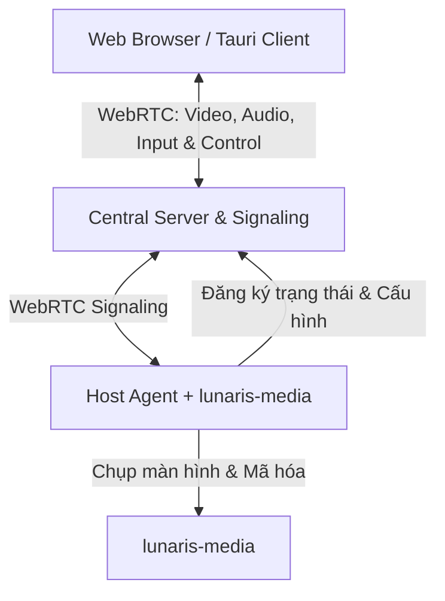

# Tài liệu Kiến trúc & Phân tích Kỹ thuật: Lunaris

Tài liệu này mô tả chi tiết kiến trúc hệ thống, luồng dữ liệu và các thành phần kỹ thuật cần thiết để xây dựng một giải pháp điều khiển máy tính từ xa mã nguồn mở hoàn toàn. Dự án này kết hợp giao diện quản lý tiện lợi của **RustDesk** và hiệu năng truyền tải siêu mượt (độ trễ cực thấp, hỗ trợ 60+ FPS) trên nền tảng Web, với **lunaris-media** là backend chụp màn hình và mã hóa video native.

---

## 1. Mục tiêu dự án
*   **Trải nghiệm người dùng:** Chỉ cần truy cập qua trình duyệt Web (hoặc ứng dụng client siêu nhẹ) để điều khiển máy tính từ xa.
*   **Hiệu năng:** Độ trễ truyền tải tối thiểu (gaming-grade), hỗ trợ tăng tốc phần cứng (GPU encoding/decoding) thông qua lunaris-media.
*   **Tiện dụng:** Thiết lập kết nối không cần cấu hình Router (hỗ trợ NAT Traversal), quản lý tập trung nhiều thiết bị qua bảng điều khiển Web Dashboard.
*   **Mã nguồn mở hoàn toàn:** Sử dụng giấy phép bản quyền thân thiện (như GPLv3) giúp cộng đồng dễ dàng đóng góp và tùy biến.

---

## 2. Bản đồ Kiến trúc Hệ thống (System Architecture)

Hệ thống được chia làm 4 thành phần chính hoạt động phối hợp:



### A. Host Agent (Ứng dụng chạy ẩn trên máy Host cần điều khiển)
*   **Ngôn ngữ:** **Rust** (sử dụng `tokio` cho các tác vụ bất đồng bộ) để đảm bảo dung lượng nhẹ, hiệu năng cao và bảo mật.
*   **Chức năng:**
    *   Sử dụng **lunaris-media** để chụp màn hình và mã hóa video thời gian thực (NVENC, AMF, QuickSync, VAAPI, Software).
    *   Tự động kết nối với **Central Server** qua WebSockets để báo cáo trạng thái (Online/Offline, cấu hình máy, tài nguyên).
    *   Xử lý tín hiệu đầu vào (chuột, bàn phím, gamepad) từ client qua WebRTC Data Channel.
    *   Cung cấp API local để Central Server có thể gửi các lệnh điều khiển hệ thống cơ bản (Restart service, Shutdown host, thay đổi độ phân giải màn hình).

### B. Central Server & Signaling (Máy chủ trung tâm)
*   **Ngôn ngữ:** **Rust (Axum)**.
*   **Chức năng:**
    *   **Web Dashboard:** Quản lý tài khoản người dùng, phân quyền truy cập thiết bị (máy nào được chia sẻ cho ai).
    *   **Device Directory (Danh bạ thiết bị):** Lưu trữ thông tin định danh máy Host (Host ID, IP nội bộ, trạng thái kết nối).
    *   **Signaling Server:** Đóng vai trò môi giới đàm phán kết nối WebRTC (trao đổi SDP Offer/Answer và ICE Candidates) giữa Web Client và Host Agent.
    *   **STUN/TURN Coordinator:** Tích hợp hoặc tự động cấp thông tin kết nối máy chủ STUN/TURN (ví dụ: dùng `coturn`) để đục lỗ NAT qua mạng Internet.

### C. lunaris-media (Thư viện chụp và mã hóa màn hình)
*   **Chức năng:** Chụp màn hình (Screen capture) và mã hóa video/audio thời gian thực.
*   **Công nghệ:** Tận dụng tối đa tăng tốc phần cứng thông qua các bộ mã hóa GPU chuyên dụng (NVENC cho NVIDIA, AMF cho AMD, Intel QuickSync và VAAPI cho Linux). Hỗ trợ mã hóa phần mềm (software) như fallback.
*   **Tích hợp:** Được sử dụng trực tiếp bởi Host Agent như một thư viện Rust native, không cần tiến trình bên ngoài.

### D. Client App (Giao diện điều khiển)
Bạn nên xây dựng 2 phiên bản Client từ một nguồn code:
1.  **Web Client (Chạy trực tiếp trên trình duyệt):**
    *   **UI Framework:** React, Vue.js hoặc Svelte kết hợp TailwindCSS (hoặc CSS thuần tối ưu).
    *   **Video/Audio:** Giải mã luồng WebRTC thông qua phần cứng của trình duyệt (sử dụng thẻ `<video>` chuẩn hoặc WebCodecs API cho các tùy biến nâng cao để giảm độ trễ tối đa).
    *   **Input Handling:** Lắng nghe sự kiện chuột, bàn phím và Gamepad API để đóng gói gửi ngược lại qua WebRTC Data Channel.
2.  **Desktop Client (Ứng dụng cài đặt - Tauri Wrapper):**
    *   Sử dụng **Tauri** để bọc giao diện Web Client trên.
    *   **Ưu điểm:** Cho phép can thiệp sâu vào hệ thống của máy khách, ví dụ: bắt các phím tắt hệ thống hệ điều hành (Alt+Tab, Win Key, Ctrl+Alt+Del), điều khiển chuột chính xác hơn (Pointer Lock API không bị giới hạn bởi trình duyệt) và hỗ trợ hiển thị đa màn hình (Multi-monitor) mượt mà hơn.

---

## 3. Luồng dữ liệu chi tiết (Detailed Data Flows)

### Quy trình 1: Đăng ký thiết bị (Host Registration)
1.  Người dùng cài đặt **Host Agent** trên máy tính cần điều khiển.
2.  Agent yêu cầu nhập thông tin đăng nhập hoặc nhập API Token sinh ra từ Web Dashboard của người dùng.
3.  Agent đăng ký ID máy lên Central Server qua kết nối bảo mật (HTTPS/WSS).
4.  Agent tự khởi tạo lunaris-media và sẵn sàng nhận kết nối streaming.

### Quy trình 2: Thiết lập kết nối điều khiển (Session Negotiation)
```
[ Web Client ]              [ Central Server ]            [ Host Agent ]
      │                              │                                │
      ├─────── 1. Yêu cầu kết nối ──►│                                │
      │                              ├────── 2. Đánh thức / Chuẩn bị ─►│
      │                              │◄───── 3. Sẵn sàng kết nối ─────┤
      │◄────── 4. Trả về SDP/ICE ────┤                                │
      │                              │                                │
      │◄====================== 5. WebRTC Handshake ==================►│
      │                  (Đục lỗ NAT qua STUN/TURN nếu cần)           │
```

### Quy trình 3: Truyền tải luồng stream (Streaming Phase)
*   **Video/Audio:**
    `Màn hình Host` -> `lunaris-media (Encode H.264/HEVC)` -> `WebRTC RTP` -> `Internet (TURN/Direct)` -> `Web Client (Giải mã bằng GPU & hiển thị)`.
*   **Tương tác (Input):**
    `Web Client (Mouse/KB Event)` -> `WebRTC Data Channel (Độ trễ < 1ms)` -> `Host Agent` -> `Hệ điều hành Host`.

---

## 4. Giải pháp vượt NAT (NAT Traversal)
Đây là yếu tố cốt lõi giúp dự án tiệm cận sự tiện dụng của RustDesk:
*   Hệ thống sẽ mặc định ưu tiên kết nối trực tiếp (Direct Connection) nếu hai máy chung mạng LAN hoặc Host có IP công cộng.
*   Nếu cả hai máy đều nằm sau NAT (mạng gia đình, mạng di động 4G/5G, tường lửa công ty):
    *   Sử dụng **STUN** để phát hiện IP công cộng và loại NAT.
    *   Tự động kích hoạt đục lỗ NAT (ICE hole punching).
    *   Nếu đục lỗ NAT thất bại, hệ thống tự động chuyển tiếp dữ liệu qua máy chủ **TURN (Relay Server)**. Do TURN server sẽ gánh toàn bộ băng thông video, bạn cần thiết kế hệ thống Central Server cho phép người dùng tự cấu hình TURN server riêng của họ hoặc sử dụng dịch vụ TURN đám mây.

---

## 5. Lộ trình phát triển đề xuất (Development Roadmap)

### Pha 1: Xây dựng Core Streaming
*   [x] Xây dựng lunaris-media với hỗ trợ chụp màn hình và mã hóa GPU.
*   [x] Tạo Host Agent tích hợp lunaris-media.
*   [x] Tạo một Web UI kết nối trực tiếp để kiểm tra độ trễ và chất lượng stream.

### Pha 2: Hệ thống hóa Central Server & NAT Traversal
*   [x] Thiết kế cơ sở dữ liệu lưu thông tin Host và User.
*   [x] Viết Signaling Server bằng Rust (Axum).
*   [ ] Tích hợp máy chủ STUN/TURN và viết cơ chế chuyển đổi tự động (Failover) khi mất kết nối trực tiếp.

### Pha 3: Phát triển Client Apps
*   [x] Viết ứng dụng Agent dạng CLI/Daemon bằng Rust.
*   [x] Xây dựng Desktop Client (Qt6/QML) với hardware video decoding.
*   [x] Xây dựng Tauri wrapper cho Desktop Client.

### Pha 4: Hoàn thiện tính năng remote & Đóng gói ứng dụng
*   [ ] Phát triển tính năng truyền file qua WebRTC Data Channel.
*   [ ] Đồng bộ hóa Clipboard hai chiều.
*   [ ] Hỗ trợ Multi-monitor.
